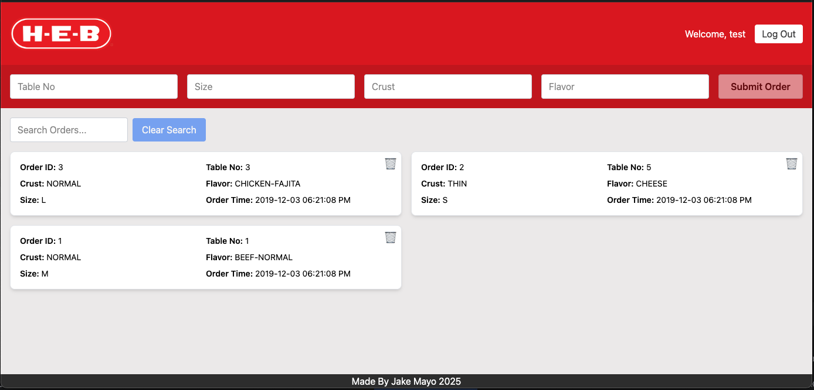

# H-E-B Pizza App 🍕

An Angular-based web application built for a senior software engineer interview coding challenge. This project demonstrates a modern frontend stack with Dockerized deployment, Tailwind CSS styling, ESLint + Prettier for code quality, and Playwright for end-to-end testing. Brainstorming Miro https://miro.com/app/board/uXjVIO0dWwA=/


---

## 🚀 Quick Start

### 🐳 Docker Setup (Recommended)
Ensure you have Docker installed before running the following commands:

```bash
# Step 1: Build the Docker image
docker build -t heb-pizza-app .

# Step 2: Run the Docker container
docker run -p 8080:80 heb-pizza-app
```

Open your browser and navigate to: [http://localhost:8080](http://localhost:8080)

---

### 🛠️ Local Development Setup

1. **Install Node.js (v20+) and npm (v10+)**
2. **Install Angular CLI globally:**
   ```bash
   npm install -g @angular/cli
   ```
3. **Install project dependencies:**
   ```bash
   npm install
   ```

4. **Start the development server:**
   ```bash
   npm run start
   ```

Open your browser and navigate to: [http://localhost:4200](http://localhost:4200)

**Linting & Formatting:**
   - Lint: `npm run lint`
   - Fix Lint: `npm run lint:fix`
   - Prettier format: `npm run prettier`

**Run Unit Tests:**
   ```bash
   npm test
   ```

**Run Playwright E2E Tests:**
   ```bash
   npm run e2e
   ```

---

## 🗂️ Project Folder Structure

```
heb-pizza-app/
├─ e2e/                          → End-to-end tests (Playwright)
├─ files/                        → Supplemental files
├─ public/                       → Static assets (e.g., images)
└─ src/                          → Main Angular application code
   ├─ index.html                 → Main HTML entry point
   ├─ main.ts                    → Angular bootstrap entry point
   ├─ styles.css                 → Global styles (includes Tailwind)
   ├─ environments/              → Environment configuration
   ├─ unit-tests/                → Unit tests
   └─ app/
      ├─ app.component.ts        → Root component
      ├─ app.routes.ts           → Routing setup
      ├─ app.config.ts           → App-level config
      ├─ constants/              → App constants
      ├─ models/                 → TypeScript models
      ├─ pipes/                  → Custom Angular pipes
      ├─ components/             → UI components (login, header, footer, home, etc.)
      └─ services/               → Angular services (API interaction, state management)
   

```

## 🧩 Technologies & Benefits

| Technology     | Description |
|----------------|-------------|
| **Angular**    | Component-based framework for scalable SPAs |
| **Tailwind CSS** | Utility-first CSS framework for fast UI styling |
| **NGINX**      | Lightweight web server used to serve production build |
| **Docker**     | Containerization tool to simplify environment setup |
| **ESLint**     | Code linting to enforce consistent and clean code |
| **Prettier**   | Code formatting tool to maintain style consistency |
| **PostCSS**    | CSS transformation tool used under the hood with Tailwind |
| **Playwright** | End-to-end testing framework for browser automation |
| **Toast (ngx-toastr)** | Lightweight notification system for user feedback via toast popups |

---

## 📏 Linting Configuration

ESLint setup includes:
- Prettier formatting integration
- TypeScript & Angular ESLint rules
- Simple Import Sort for organizing imports
- Filename & folder naming conventions
- Angular selector conventions (`app-*`, camelCase attributes)

See `eslint.config.js` for full configuration.

---

## ✅ Why This Stack?

- **Fast local and production setup using Docker**
- **Strong type safety with Angular and TypeScript**
- **Clean, maintainable code with strict linting rules**
- **Beautiful UI styling with minimal CSS using Tailwind**
- **Future-proof testing setup with Playwright**
- **Clear distinction between production and test code for maintainability**

---

## 📬 Feedback

This is my first Angular project — any feedback is welcome! 🙌
